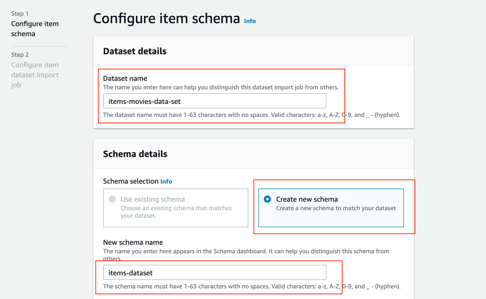
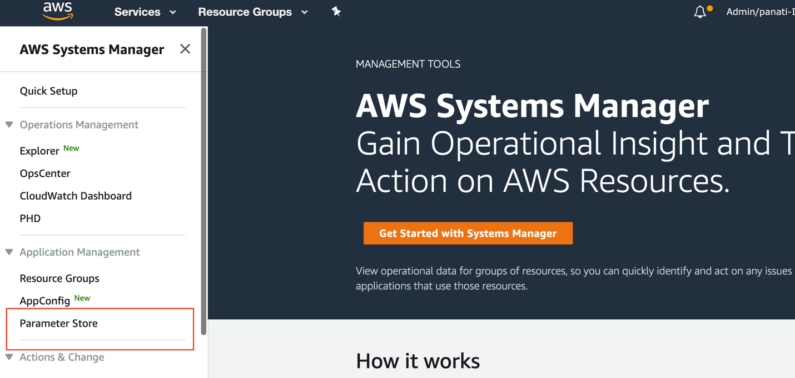

# Movie Recommendations Engine using MovieLens Dataset, Amazon Personalize, .NET Core, and ASP.NET MVC

Overview
========

 

This walkthrough outlines the steps to build a movie recommendations engine web
application using Amazon Personalize, ASP.NET MVC and .NET Core Framework.

Topics Covered
==============

 

In this walk-through, you’ll build the following – Configure Amazon Personalize
using the MovieLens Data Set to generate inferences for movies based on user
preferences, and click stream activity and then build a sample ASP.NET MVC .NET
Core Web application by integrating with Amazon Personalize API’s and using OMDb
Api’s for thumbnails.

Pre-requisites
==============

 

-   *An AWS account with Administrative rights*

-   *Select the us-east-1 (N.Virginia) Region*

-   *Visual Studio 2019 Community Edition or better with the AWS toolkit
    installed and aws profile configured*

-   *.NET Core 3.1 runtime*

-   *Download the [Movie Lens Data Set](https://grouplens.org/datasets/movielens/) to generate inferences using Amazon
    Personalize*

-   [OMDb *Search API](http://www.omdbapi.com/) by Imdb Movie Id to access movie thumbnails information
    etc.*

 

Task 1. Download the MovieLens Data Set
---------------------------------------

 

### Step 1: Download the MovieLens 25M Dataset from here

<https://grouplens.org/datasets/movielens/>

This data set contains 25 million ratings applied to 62,000 movies by 162,000
users.

### Step 2: After you’ve downloaded the dataset, unpack it and locate the following files:

*-links.csv (file which contains the movie id – imbdb id mappings)*

*-movies.csv (movie item information)*

*-ratings.csv (this file contains user-item interactions)*

 

Task 2: Pre-process the files as below to make it compatible with Amazon Personalize for ingestion
--------------------------------------------------------------------------------------------------

 

### Step 1: Rename the column headers in ratings.csv file as shown below

userId USER_ID

movieId ITEM_ID

timestamp TIMESTAMP

### Step 2: Rename the movies.csv to items.csv and change the column headers as shown below

movieId ITEM_ID

The above steps are needed to ensure that the dataset complies with the schema
definitions, and Avro schema conventions required by Amazon Personalize.

 

Task 3: In this task, we’ll upload the MovieLens pre-processed files from the previous task to Amazon S3 to make it available for the Amazon Personalize service.
-----------------------------------------------------------------------------------------------------------------------------------------------------------------

 

### Step 1: Login to you aws management console using the link below:

<https://console.aws.amazon.com/console/home?region=us-east-1>

If you don’t have an AWS Account, go through the signup process and then sign-in
to the aws management console.

### Step 2: Once you login to your aws management console, you will see something like this.


### Step 3: Under the All Services Section, under Storage, click on the service S3 to get into the AWS Amazon S3 Console


### Step 4: Create an S3 bucket with the prefixes as outlined below.

Please be aware that the S3 bucket names are unique and choose a name
accordingly. There is no such restriction on the S3 prefixes.


### Step 5: Now that you have an S3 bucket and the prefixes in place, upload the movie lens files from the previous task as below.

-   *Upload the items.csv file into s3bucket/items prefix*

-   *Upload the links.csv into s3bucket/links prefix*

-   *Upload the ratings.csv into s3bucket/ratings prefix*

### Step 6: Set the bucket policy to allow the Amazon Personalize to access the S3 bucket as shown below.


```
{
   "Version":"2012-10-17",
   "Id":"PersonalizeS3BucketAccessPolicy",
   "Statement":[
      {
         "Sid":"PersonalizeS3BucketAccessPolicy",
         "Effect":"Allow",
         "Principal":{
            "Service":"personalize.amazonaws.com"
         },
         "Action":[
            "s3:GetObject",
            "s3:ListBucket"
         ],
         "Resource":[
            "arn:aws:s3:::prpa-amzn-personalize-demo",
            "arn:aws:s3:::prpa-amzn-personalize-demo/\\*"
         ]
      }
   ]
}

```

Make note of the Amazon S3 bucket created from this task. You’ll need this
information in the subsequent sections as you configure Amazon Personalize and
the Web Application.

 

Task 4: In this task, we’ll configure the Amazon Personalize service to ingest the movie lens data set files from S3 bucket in the previous steps and then train the service to generate inferences
---------------------------------------------------------------------------------------------------------------------------------------------------------------------------------------------------

 

### Task 4.1: In this task, we’ll configure Amazon Personalize

#### Step 1: From the AWS Console, under the Machine Learning section, click on the Amazon Personalize service


#### Step 2: Once you are in the Amazon Personalize console view, click the ‘Get started’ button as shown below.


#### Step 3: Create a Dataset Group named **‘amzn-personalize-demo’** and click Next


#### Step 4: Create the dataset for user interactions data with the following details. Refer to the screenshots below.

*Dataset name: user-interactions-data-set*

*Schema Definition Name: user-interactions-data-set-schema*

*Schema Details: Choose Create new schema option.*

Amazon Personalize requires that your schema conforms to Avro specifications.
The data file that you point to be needs to be in a CSV format.

Schema definition:

```
{
   "type":"record",
   "name":"Interactions",
   "namespace":"com.amazonaws.personalize.schema",
   "fields":[
      {
         "name":"USER_ID",
         "type":"string"
      },
      {
         "name":"ITEM_ID",
         "type":"string"
      },
      {
         "name":"TIMESTAMP",
         "type":"long"
      }
   ],
   "version":"1.0"
}

```


And click Next.

#### Step 5: Next configure the job that will import the data from the S3 bucket with the following details. Refer to the screenshots below.

*Dataset import job name: user-interactions-ratings-job*

*IAM service role: In the drop-down select ‘Create an IAM role’ and fill in the
S3 bucket name from the previous steps as shown below and click ‘Create role’
button.*


And enter the S3 path for the user-interactions data as below and click finish

*Data location: s3://prpa-amzn-personalize-demo/ratings/*


#### Step 6: Similar to the previous steps, go ahead and create a Dataset for the Item type as shown below with these details


*Dataset name: items-movies-data-set*

*Schema details: Create new schema with the schema definition as below*

*Schema Name: items-dataset-schema-def*

*Dataset import job name: items-movies-data-set-job*

*IAM service role: select the IAM role created from the previous step*

*Data location: s3://prpa-amzn-personalize-demo/items/*

```

{
   "type":"record",
   "name":"Items",
   "namespace":"com.amazonaws.personalize.schema",
   "fields":[
      {
         "name":"item_id",
         "type":"string"
      },
      {
         "name":"title",
         "type":"string",
         "categorical":true
      },
      {
         "name":"genres",
         "type":"string",
         "categorical":true
      }
   ],
   "version":"1.0"
}

```




Make note of the Dataset group name and the datasets names.

In the next section, you’ll create Solutions using pre-defined recipes to train
the AI/ML models on the data that was imported into Amazon Personalize

### Task 4.2: In this section, we’ll create 4 solutions to train and generate inferences for Personalized recommendations, Similar Movies, Most Popular Movies, and a solution to re-rank the most popular movies for a user.

#### Step 1: From the Amazon Personalize console, click on the link Solutions and recipes as shown below


#### Step 2: In the Solution and recipes click on the Create solution button

And create the following solutions

*Solution name: demo-items-solution*

*Recipe: Choose aws-sims recipe from the drop down*


Click Next and in the next screen click Finish.


Repeat the above steps and create the following solutions

*Solution name: demo-personalized-ranking-recipe-solution*

*Recipe: Choose aws-personalized-ranking recipe from the drop down*

*Solution name: demo-popularity-count-recipe-solution*

*Recipe: Choose aws-popularity-count recipe from the drop down*

*Solution name: demo-personal-recommendations*

*Recipe: Choose aws-user-personalization recipe from the drop down*

Once you are done creating the above four recipes, your solutions and recipes
view will look like this


The above Solutions will take time (an hour or so) to train, so take a break and
come back and get to the next section.

In the next section, you will start creating Campaigns which allows our web
application to query for recommendations using the REST API’s

### Task 4.3: In this section, you will start creating Campaigns for the above solutions as below

#### Step 1: Create a campaign for **demo-Similar-Items-SIMS** similar movies with the following details as shown below


#### Step 2: Create a campaign for **demo-personal-recommendations** with the defaults for Campaign configuration following details as shown below


#### Step 3: Create a campaign for **demo-personal-ranking** with the following details as shown below


#### Step 4: Create a campaign for **demo-Similar-Items-Most-Popular** with the following details as shown below


Once the campaigns are Active, make note of the Campaign URLs for all of the
four campaigns that were created from the previous steps.

For example, select the campaign and under the Personalization API section, make
note of the Campaign ARN like below.


In the next section, we’ll create an Event Tracker to track the click stream
events for the user as they interact on the site and use this click stream data
to generate real-time recommendations

### Task 4.4: In this section, we’ll create an Event Tracker to capture the user’s click stream events which will be used to generate real-time recommendations

#### Step 1: From the Amazon Personalize console, click on the Event Tracker as shown below


#### Step 2: Click the Create event tacker button and configure it as shown below


#### Step 3: Once the event tracker is created, click the **movie-click-tracker** item on the console to view the details as shown below


Make note of the Tracking ID.

With the above steps, you’ve successfully configured Amazon Personalize to
generate movie recommendations based on the MovieLens dataset and also
configured a movie click tracker to track click stream data from the web
application.

Make note of the following outputs as you’ll need these to configure your
application to talk to integrate with Amazon Personalize

*S3 Bucket Name: prpa-amzn-personalize-demo*

*Movie-click-tracker ID: d2847fec-5c07-4946-9142-20add8924571*

*demo-personal-recommendations campaign arn:*

*arn:aws:personalize:us-east-1:474833482531:campaign/demo-personal-recommendations*

*demo-personal-ranking campaign arn:
arn:aws:personalize:us-east-1:474833482531:campaign/demo-personal-ranking*

*demo-Similar-Items-Most-Popular campaign arn:*

*arn:aws:personalize:us-east-1:474833482531:campaign/demo-Similar-Items-Most-Popular*

*demo-Similar-Items-SIMS campaign arn:*

*arn:aws:personalize:us-east-1:474833482531:campaign/demo-Similar-Items-SIMS*

In the next section, you’ll provision OMDb Api which will be used to retrieve
movie thumbnail information for use in the web application.

 

Task 5: In this section, you’ll provision an OMDb API’s which will be used to request movie thumbnails information for our web application
------------------------------------------------------------------------------------------------------------------------------------------

 

### Step 1: Browse to the <http://www.omdbapi.com/apikey.aspx> and generate an API Key


### Step 2: Read about the api usage in detail here: <http://www.omdbapi.com/>

Make note of the API Key.

In the next section, we’ll use AWS Systems Manager Parameter Store to store all
the above outputs so that these are available for our web application

 

Task 6: In this section, we’ll use Systems Manager Parameter Store to store all the outputs from the previous section to make it available for the web application
------------------------------------------------------------------------------------------------------------------------------------------------------------------

 

### Step 1: From the AWS Console, Got Systems Manager as shown below


### Step 2: Click on the Parameter Store as shown below



### Step 3: Create the following Parameters as shown below

*Name: /amz-personalize-demo/demo-click-stream-trk-id*

*String Value: movie-click-tracker tracking id from the previous section*


*Repeat the above steps for the rest of the parameters as shown below and add
the corresponding campign arn’s for demo-personal-ranking,
demo-personal-recommendations, demo-s3-bucket-name, demo-sims-arn,
demo-sims-most-popular and imdb-api-key values from the previous section.*


In the next section, you will download the sample web application which you will
use to interact with AWS SDK and Amazon Personalize API’s.

 

Task 6: In this section, you will configure an IAM user with Programmatic credentials and store these credentials in the aws credentials file on your computer where you will be running the web application
------------------------------------------------------------------------------------------------------------------------------------------------------------------------------------------------------------

 

Refer to:
<https://net-immersionday.workshop.aws/2-how-how-to-deploy-donet-apps.html>

And follow the steps outlined in the above link.

 

Task 7: In this section, I’ll walk you through at a high level how the web application is structured and how it integrates with Amazon Personalize to request movie recommendations and how it uses the Imdb API to request thumbnails for the movies and display it on the web page.
-------------------------------------------------------------------------------------------------------------------------------------------------------------------------------------------------------------------------------------------------------------------------------------

 

*Architectural Overview: The web application is built using .NET Core 3.1,
ASP.NET MVC, Bootstrap and AWS SDK, Amazon S3 API’s, Amazon Personalize APIs and
OMDb Api.*

*OMDb Api is used to retrieve the thumbnail information for the movies.*

### Step 1: Download the sample web project at this location

Once downloaded, unpack the application and open the solution using Visual
Studio 2019.

### Step 2: Compile the solution to make sure there are no build errors and proceed to the next step

### Step 3: Start running the application and you will start to see the movie recommendations for users.


Summary
=======


In this walkthrough, we have demonstrated how you can integrate with Amazon
Personalize to build a Movie Recommendations Engine without having to have any
Machine Learning experience.


## Security

See [CONTRIBUTING](CONTRIBUTING.md#security-issue-notifications) for more information.

## License

This library is licensed under the MIT-0 License. See the LICENSE file.
